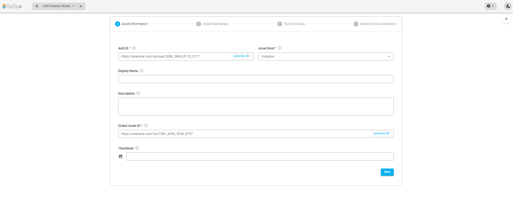
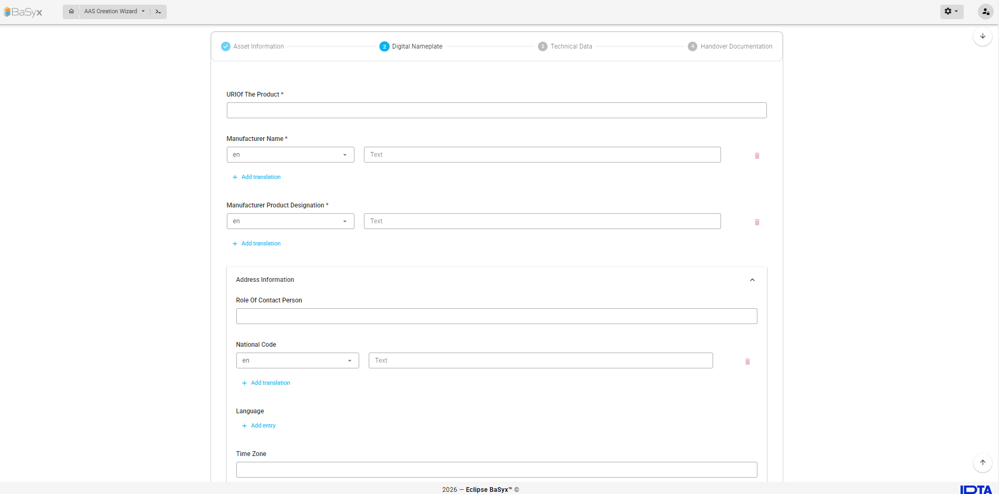
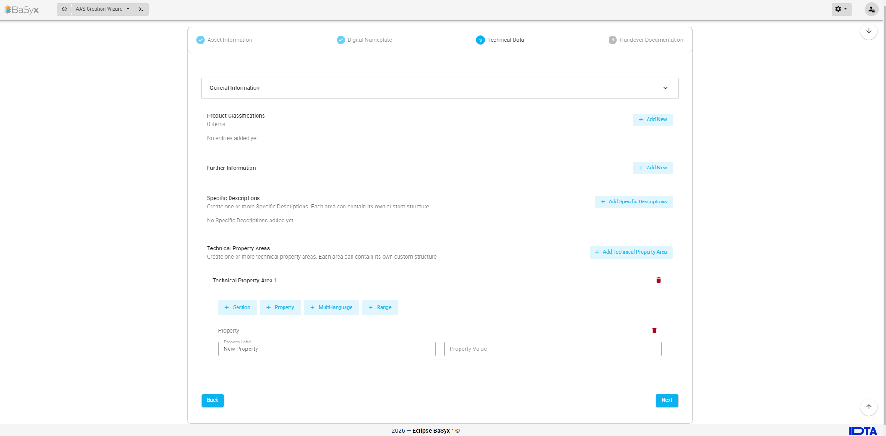
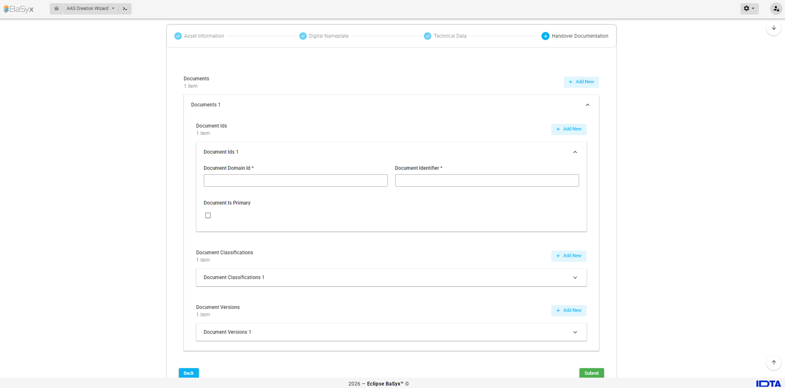
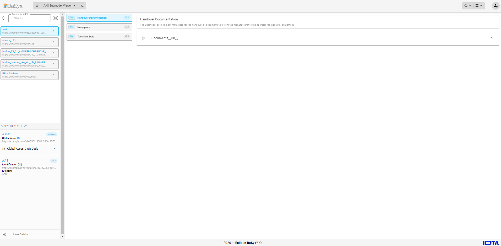

# AAS Creation Wizard

The **AAS Creation Wizard** provides a guided way to create an **Asset Administration Shell (AAS)** together with a predefined set of associated Submodels.

Instead of manually creating the AAS and each Submodel individually, the wizard guides the user through the required asset information and Submodel-specific data in a step-by-step form.

The Submodel forms are based on the corresponding **IDTA Submodel Templates**, allowing the resulting Submodels to follow standardized structures and semantics.

Currently, the wizard supports the following Submodels:

- **Digital Nameplate**
- **Technical Data**
- **Handover Documentation**

The creation process consists of four steps:

1. Asset Information
2. Digital Nameplate
3. Technical Data
4. Handover Documentation

After completing the wizard, the AAS and the associated Submodels are created and the corresponding **Submodel references are added to the Asset Administration Shell**.

---

## Accessing the AAS Creation Wizard

The wizard is available as a module in the BaSyx AAS Web UI.

To open it:

1. Open the **BaSyx AAS Web UI**.
2. Open the **Modules** menu in the navigation bar.
3. Select **AAS Creation Wizard**.

The wizard opens with the first step, **Asset Information**.

---

## Step 1 – Asset Information

The first step defines the basic information required to create the Asset Administration Shell and identify its corresponding asset.

The available fields include, among others:

- **AAS ID**
- **Asset Kind**
- **Display Name**
- **Description**
- **Global Asset ID**
- **Thumbnail**

Required fields are marked with `*`.

For identifier fields such as the **AAS ID** and **Global Asset ID**, the wizard also provides a **Generate IRI** option which can be used to generate an identifier automatically.

After entering the required asset information, select **Next** to continue.



---

## Step 2 – Digital Nameplate

The second step creates the **Digital Nameplate Submodel**.

The form follows the structure defined by the corresponding IDTA Digital Nameplate Submodel Template. The template structure is represented through form fields, nested sections, and collections in the wizard.

Typical information includes:

- URI of the product
- Manufacturer name
- Manufacturer product designation
- Manufacturer product root
- Manufacturer product family
- Manufacturer product type
- Manufacturer article number
- Manufacturer order code
- Address information
- Additional nameplate information

Several textual properties support **multilingual values**. Additional translations can be entered using **Add translation**.

After completing the relevant fields, select **Next**.



---

## Step 3 – Technical Data

The third step creates the **Technical Data Submodel** based on the IDTA Technical Data Submodel Template.

The form contains the standardized sections and properties defined by the template, including information such as:

- General information
- Manufacturer information
- Product designation
- Product and article identifiers
- Product images
- Product classifications
- Technical properties

The Technical Data Submodel also contains structures that are not limited to a fixed number of predefined properties.

To support these structures, the wizard allows users to dynamically create additional **Submodel Elements and Submodel Element Collections** where permitted by the template.

This makes it possible to represent larger and more complex technical-data structures directly within the wizard instead of manually editing the resulting Submodel afterwards.

Items in repeating sections can be created using **Add New**.



---

## Step 4 – Handover Documentation

The final step creates the **Handover Documentation Submodel**.

The form follows the corresponding IDTA Handover Documentation Submodel Template and allows documentation-related information to be entered in a structured form.

For example, users can create:

- Documents
- Document identifiers
- Document classifications
- Document metadata
- Multilingual document information
- Additional nested document information defined by the template

Collections that can occur multiple times can be extended using **Add New**.

For example, multiple documents, document IDs, or document classifications can be represented within the same Submodel.



---

## Creating the AAS

After all required information has been entered, the wizard can be completed using **Submit**.

During submission, the information entered in the individual steps is transformed into AAS-compliant objects.

The wizard then creates the configured Submodels and the Asset Administration Shell and associates the created Submodels with the AAS through Submodel references.

Conceptually, the resulting structure is:

```text
Asset Administration Shell
│
├── Reference → Digital Nameplate Submodel
│
├── Reference → Technical Data Submodel
│
└── Reference → Handover Documentation Submodel
```

The Submodels are independent AAS objects and are referenced from the Asset Administration Shell using model references.

Once creation is complete, the resulting AAS and its associated Submodels can be accessed and inspected through the BaSyx AAS Web UI.

---

## Dynamic and Repeating Elements

Some IDTA Submodel Templates contain structures that may occur multiple times or contain nested elements.

The wizard supports such structures through reusable and dynamically generated form components.

Depending on the template, users can:

- Add multiple entries using **Add New**
- Create nested collections
- Add additional Submodel Elements
- Remove previously created entries
- Add translations to multilingual properties

This is particularly relevant for the **Technical Data Submodel**, where technical properties can contain more complex and extensible structures.

---

## Validation

The wizard performs form validation before progressing or creating the AAS.

Mandatory properties are marked with `*`.

If a required value is missing, the corresponding field is highlighted and an error message is displayed.

For example:

```text
AAS ID is required.
```

Users must complete the mandatory fields before the corresponding data can be submitted successfully.

---

## Result

After successful completion, the wizard creates an Asset Administration Shell with the associated standardized Submodels:

```text
AAS
├── Digital Nameplate
├── Technical Data
└── Handover Documentation
```

The created Submodels follow the structures of the corresponding IDTA Submodel Templates, while the AAS maintains references to these Submodels.

The AAS Creation Wizard therefore provides a simplified workflow for creating a standardized initial digital representation of an asset without requiring users to manually construct the complete AAS and Submodel structures.



---

## References

The AAS Creation Wizard is based on the Asset Administration Shell specifications and Submodel Templates published by the **Industrial Digital Twin Association (IDTA)**.

Further information can be found at:

- [Asset Administration Shell Specifications](https://industrialdigitaltwin.org/en/content-hub/aasspecifications)
- [IDTA Submodel Templates](https://industrialdigitaltwin.org/en/content-hub/submodels)