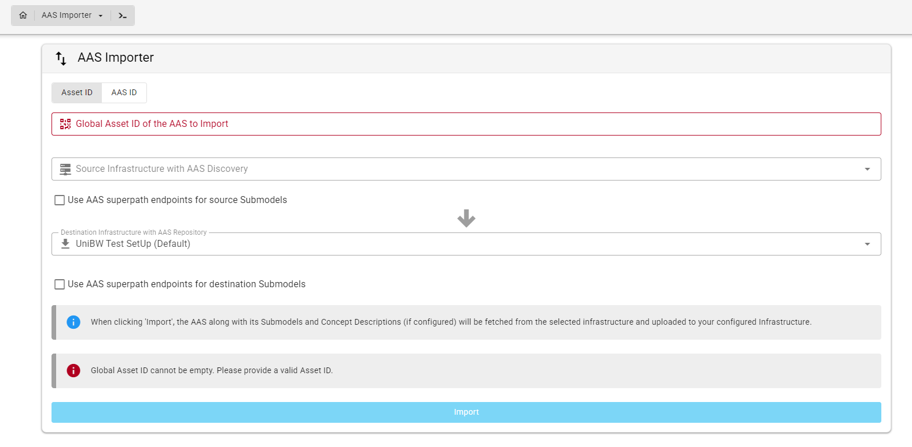

# Modules

> **As a** BaSyx AAS Web UI user  
> **I want to** access additional tools and workflows within the Web UI  
> **so that** I can perform domain-specific and cross-cutting AAS tasks through a unified user interface.

## Feature Overview

Modules extend the BaSyx AAS Web UI with **application-level functionality for specific use cases and workflows**.

A module can provide its own pages, forms, dashboards, navigation, and business logic while still being integrated into the common BaSyx AAS Web UI.

Modules are particularly suited for functionality that goes beyond the visualization or interaction with a single Submodel or SubmodelElement.

```{hint}
A module could also be implemented as a standalone application. Within the BaSyx AAS Web UI, modules are integrated into the common platform to provide a unified user experience.

This provides two main advantages:

- **Consistency**: Modules share the common Web UI structure, navigation, appearance, and available platform services.
- **Extensibility**: Additional domain-specific functionality can be integrated as modules without changing the basic user experience of the Web UI.
```

---
## Modules and Plugins

Modules and plugins both extend the functionality of the BaSyx AAS Web UI, but they serve different purposes.

| | Modules | Plugins |
| --- | --- | --- |
| **Purpose** | Provide complete application-level tools and workflows | Provide specialized visualization or interaction for AAS data |
| **Scope** | Can work across multiple Submodels, AASs, or services | Usually focused on a particular Submodel or SubmodelElement |
| **Access** | Opened from the **Modules** section of the main navigation | Displayed within the visualization of a Submodel or SubmodelElement |
| **Context** | Can provide independent workflows, forms, dashboards, and navigation | Typically selected automatically based on the Semantic ID of AAS data |
| **Examples** | AAS Creation Wizard, AAS Importer, Company Data Portal | Digital Nameplate, Time Series Data, Technical Data |

In general:

- Use a **plugin** when specialized visualization or interaction is required for a particular Submodel or SubmodelElement.
- Use a **module** when the functionality represents a larger workflow, application, dashboard, or domain-specific use case.

---
## Accessing Modules

Modules can be accessed through the main navigation menu of the BaSyx AAS Web UI.

The navigation menu contains separate sections for:

- **AAS** – functionality related to Asset Administration Shells
- **Submodel** – functionality related to Submodels and SubmodelElements
- **Modules** – additional application-level tools and workflows

To open a module:

1. Open the main navigation menu.
2. Select the **Modules** tab.
3. Select the desired module.


Selecting a module opens its corresponding application view inside the BaSyx AAS Web UI.

```{note}
The available modules may differ depending on the Web UI configuration, selected infrastructure, current AAS context, authentication, and device.

Therefore, not every module is necessarily visible in every BaSyx AAS Web UI setup.
```

---

## Available Modules
The following modules are currently available or included in selected BaSyx AAS Web UI configurations.

**[AAS Creation Wizard](modules/aas_creation_wizard.md)**

- Provides a guided workflow for creating an Asset Administration Shell and associated Submodels
- Currently supports Digital Nameplate, Technical Data, and Handover Documentation
- Uses forms based on the corresponding IDTA Submodel Templates

**[AAS Importer](modules/aas_importer.md)**

- Transfers an Asset Administration Shell from a source infrastructure to a configured destination infrastructure
- Supports identification using either an Asset ID or an AAS ID
- Can transfer associated Submodels and Concept Descriptions, depending on the configuration

<!--  -->

**[Company Data Portal](modules/company_data_portal.md)**

- Provides a structured interface for managing company-related information
- Includes sections for company identification, bank accounts, digital interfaces, business report figures, and company governance
- Supports structured and multilingual information where applicable

**[PCF Process](modules/pcf_process.md)**

- Provides a workflow for initiating Product Carbon Footprint related production processes
- Allows users to search for and select available product types
- Supports starting the corresponding production process for a selected product

**[Query Language](modules/query_language.md)**

- Provides a test interface for executing queries against AAS-related API components
- Allows users to select an API component and enter queries in JSON format
- Displays the corresponding query results directly in the Web UI

**[DPP Demo](modules/dpp_demo.md)**

- Demonstrates Digital Product Passport related functionality
- Shows how DPP-specific use cases can be integrated as a module within the BaSyx AAS Web UI

**[Module Routing Showcase](modules/module_routing_showcase.md)**

- Demonstrates module-specific routing and navigation
- Serves primarily as a reference for developing and integrating custom modules

## Developing Custom Modules

The BaSyx AAS Web UI can be extended with additional custom modules.

Custom modules can provide their own application views, workflows, navigation, and integration with shared BaSyx Web UI functionality.

For information about implementing a custom module, see the [Developing Custom Modules](../../../../developer_documentation/basyx_web_ui/developing_custom_modules.md) documentation.


```{toctree}
:hidden:
:maxdepth: 1

modules/aas_creation_wizard
```